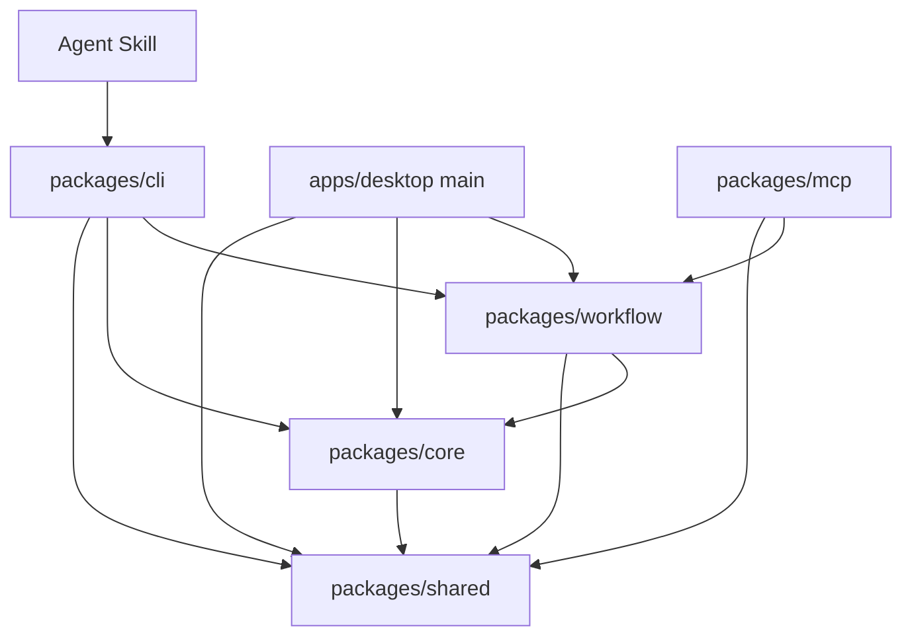
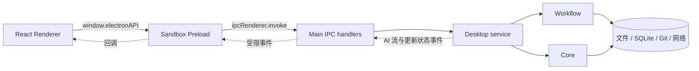

# 系统架构

Weekly Git Report 是一个 pnpm Monorepo。业务规则集中在 `shared`、`core` 和 `workflow`，Desktop、CLI、MCP 与 Skill 只是不同的入口或适配器。

## 分层与依赖

依赖只从适配器流向业务层。`core` 和 `workflow` 不依赖 Desktop、CLI 或 MCP，因此各入口不会复制同步、采集、保存和推送规则。

## 模块职责

| 模块                         | 类型             | 职责                                                          |
| ---------------------------- | ---------------- | ------------------------------------------------------------- |
| `packages/shared`            | 契约层           | 常量、Zod Schema、稳定 DTO 和推导类型                         |
| `packages/core`              | 领域与基础设施层 | 配置、Git、仓库缓存、采集、模板、报告索引、路径和原子文件写入 |
| `packages/workflow`          | 用例编排层       | ReportRun、SQLite、内置 AI、飞书、系统调度和跨步骤一致性      |
| `packages/cli`               | 命令行适配器     | 交互配置、用户命令和稳定 JSON 自动化接口                      |
| `packages/mcp`               | MCP 适配器       | external-agent Run 的四个 stdio 工具                          |
| `apps/desktop`               | Electron 适配器  | 主进程服务、受限 IPC、React 界面和桌面更新                    |
| `skills/weekly-git-report`   | Agent 规约       | 指导宿主通过 CLI 安全完成 external-agent Run                  |
| `packages/typescript-config` | 构建配置         | 共享 TypeScript 和 tsup 配置                                  |

## Shared：跨层契约

`packages/shared` 位于依赖链底部，只依赖 Zod。它定义：

- 配置、仓库、报告类型和周期。
- 采集 manifest、生成输入和报告关联信息。
- ReportRun、步骤、任务、AI 和飞书配置。
- CLI/MCP 输入和跨 Electron IPC 使用的稳定结构。
- 工作目录、文件名和默认路径常量。

持久化数据进入业务层前必须通过相应 Schema 校验。类型由 Schema 推导，避免运行时验证和 TypeScript 类型各自演进。

## Core：本地领域能力

`packages/core` 只依赖 `shared`，负责不含 UI 的本地能力：

- 初始化和读取配置，使用 revision 防止并发覆盖。
- 规范化仓库 URL，计算缓存路径并阻止重复配置。
- 创建裸仓库缓存、验证 `origin`、获取指定远程分支。
- 按周期、分支和作者身份采集提交。
- 写入 Raw Markdown、索引和 manifest。
- 读取和更新四种报告模板。
- 索引规范报告目录，校验报告正文与 Sidecar。
- 通过安全路径和原子写避免越界与半写文件。

Core 不直接调用 AI、飞书或操作系统调度器，也不提供用户命令。

## Workflow：应用用例

`packages/workflow` 依赖 `core` 与 `shared`，把领域能力编排成完整用例：

- `report-run`：准备、生成、审核、保存、发布、取消和重试。
- `run-store`：使用 Node.js 内置 SQLite 保存运行状态和步骤。
- `ai`：通过 AI SDK 连接 OpenAI 和 DeepSeek。
- `feishu`：签名、消息构建、内容校验和有限重试。
- `scheduler`：适配 Windows、macOS 和 Linux 原生调度器。
- 低阶工作流：项目列表、同步、采集、Raw 读取和 Summary 保存。

跨步骤的一致性校验也位于这一层，包括生成输入哈希、模板 revision、Raw manifest 哈希和报告内容哈希。

## Desktop 架构

Desktop 由 Electron Main、Preload、共享 IPC 契约和 React Renderer 组成。

### Renderer

- React + TanStack Router Hash History。
- React Query 管理 IPC 查询、缓存和变更状态。
- 只引用共享类型或可在浏览器运行的 Schema。
- 不直接访问 Node.js、文件系统、Git 或网络密钥。

### Preload

- 在沙箱环境中通过 `contextBridge` 暴露冻结的 `window.electronAPI`。
- 每个方法只映射到允许的 IPC channel。
- 对主进程事件提供显式订阅和取消订阅接口。

### Main

- IPC handler 校验 Renderer 输入后调用 Desktop service。
- Desktop service 组合 Core 与 Workflow，并重新校验路径和返回值。
- 主进程负责 Git、文件、SQLite、AI、飞书、系统调度和应用更新。
- 带 `--run-task` 启动时执行一次计划任务并退出，不显示日常窗口。

## CLI 与 MCP

### CLI

CLI 是交互配置和自动化适配器。交互命令使用终端提示；非交互命令只向 stdout 输出 JSON，把诊断写入 stderr。公开构建通过 tsup 将内部 `@weekly-git-report/*` 包打入最终产物。

### MCP

MCP 是 stdio server，只暴露：

- `prepare_report`
- `complete_report`
- `fail_report`
- `publish_report`

输入由 `shared` Schema 校验，执行委托给 `workflow`。MCP 不实现配置、仓库、AI 或任务管理。

## 关键边界

- **配置边界**：JSON、模板和任务使用 revision + expected revision 阻止静默覆盖。
- **运行边界**：SQLite 的状态转换与唯一活动索引协调多个 CLI/Desktop 进程。
- **路径边界**：Raw、Summary、历史和回收站操作必须位于配置的报告目录内。
- **生成边界**：AI/Agent 只接收脱敏 generation input，不把 Raw 路径作为补充数据源。
- **发布边界**：飞书只发送已保存且 Sidecar 与正文哈希匹配的报告。
- **Electron 边界**：Renderer 只能通过白名单 Preload API 请求主进程能力。

## 主要入口

| 功能             | 入口                                             |
| ---------------- | ------------------------------------------------ |
| Shared 导出      | `packages/shared/src/index.ts`                   |
| Core 导出        | `packages/core/src/index.ts`                     |
| Workflow 导出    | `packages/workflow/src/index.ts`                 |
| ReportRun 编排   | `packages/workflow/src/report-run.ts`            |
| Run 数据库       | `packages/workflow/src/run-store.ts`             |
| 系统调度         | `packages/workflow/src/scheduler.ts`             |
| CLI              | `packages/cli/src/index.ts`                      |
| MCP              | `packages/mcp/src/index.ts`                      |
| Desktop Main     | `apps/desktop/electron/main/index.ts`            |
| Desktop IPC      | `apps/desktop/electron/main/ipc/register-ipc.ts` |
| Desktop Preload  | `apps/desktop/electron/preload/index.ts`         |
| Desktop Renderer | `apps/desktop/src/main.tsx`                      |
| IPC 类型         | `apps/desktop/shared/ipc.ts`                     |

## 相关文档

- [工作原理](how-it-works.md)
- [数据与存储](data-and-storage.md)
- [安全与隐私](security.md)
- [开发指南](development.md)
