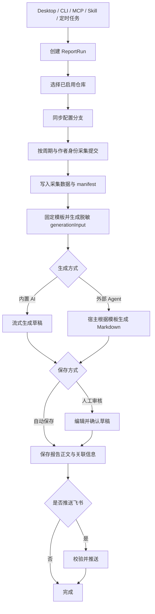
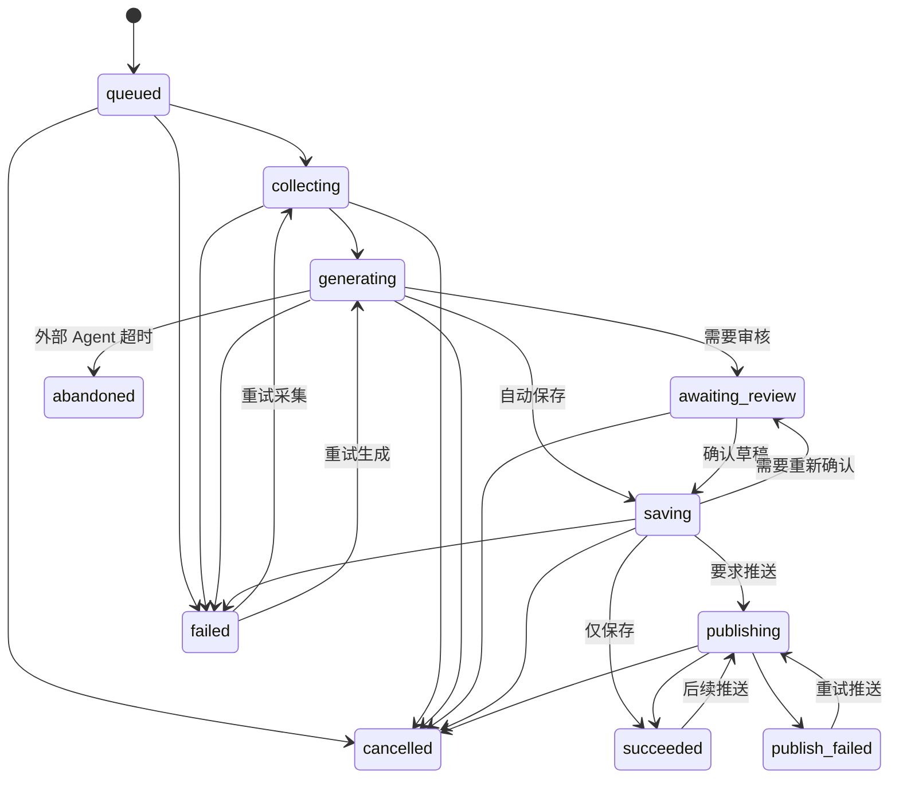

# 工作原理

Weekly Git Report 把所有报告入口统一为 ReportRun。Desktop 内置 AI、CLI、MCP、Agent Skill 和系统定时任务最终都进入同一套同步、采集、生成、保存和推送流程。

## 报告生成主流程

## 同步与采集

系统只处理 `projects.json` 中明确配置且启用的仓库。每个仓库包含远程 URL、采集分支、本地缓存路径和可选的专属作者身份。

同步时会：

1. 验证缓存仓库的 `origin` 是否与配置一致。
2. 创建或更新裸仓库缓存，不检出日常开发工作区。
3. 将配置分支获取到 `refs/remotes/origin/<branch>`。
4. 从该远程引用读取指定日期范围内的提交，不依赖本地 `HEAD`。
5. 优先使用仓库专属身份，否则使用全局 Git 作者身份筛选提交。

命令行临时传入的作者优先级高于仓库和全局配置。姓名和邮箱使用完整值匹配，忽略大小写。

单个仓库失败不会阻止其他仓库完成同步和采集，但本次 Run 会记录失败并停止进入可信生成流程。系统不会用旧缓存冒充本次同步结果。

## 采集数据与生成输入

采集完成后会写入采集数据（Raw）：

- 每个仓库的 Markdown 提交记录。
- 当前日期范围的 `index.md`。
- 描述项目文件、提交数量和错误的 `manifest.json`。

随后系统读取指定报告类型的模板，固定模板 revision，计算 manifest 哈希，并生成 `generation-input.json`。提供给 AI 或 Agent 的 `generationInput` 是结构化、脱敏的事实集合，不等同于 Raw 文件。

默认生成输入包含：

- 仓库 ID、名称和分支。
- 提交哈希、时间、标题、正文和作者姓名。
- 用户明确填写的补充背景。

它不会专门提供作者邮箱、本地路径、远程 URL 或代码差异。提交正文和补充背景本身已有的内容不会被二次改写，因此仍应在发送前理解其数据边界。

## 内置 AI 与外部 Agent

### 内置 AI

Desktop 或 CLI 使用已经测试成功的 OpenAI/DeepSeek 配置。应用校验 generation input 哈希、模板 revision 和 Raw manifest 哈希后流式生成 `draft.md`。

模型与生成参数由应用管理，不提供自动供应商切换；连接和生成失败会直接返回错误。

### 外部 Agent

CLI、MCP 和 Skill 使用 external-agent Run：

1. `prepare` 阶段完成同步、采集、模板固定和生成输入准备。
2. 外部 Agent 只根据返回的 `template` 与 `generationInput` 生成最终 Markdown。
3. `complete` 阶段把 Markdown 写入同一个 Run，再复用统一保存与推送链路。

外部 Agent 不应读取 Run 目录中的 Raw、manifest 或其他路径来补充已排除的信息。无法完成时应显式失败；支持取消的入口在放弃或只预览时应取消 Run，避免长期占用活动槽位。

## 审核、保存与推送

生成草稿不等于已经保存报告：

- **草稿审核模式**：Run 进入 `awaiting_review`，用户可以编辑内容，确认后才写入报告库。
- **自动保存模式**：任务生成完成后直接写入报告库，不经过人工审核。
- **飞书推送**：是保存后的独立选项。报告可以只保存不推送；推送失败也不会删除已经保存的文件。

保存时会再次校验模板、生成输入和 manifest，并同时写入报告正文（Summary）与关联信息文件（Sidecar，`.meta.json`）。Sidecar 记录报告来源、Run、生成器、模板 revision、Raw manifest 哈希和正文哈希。

同一类型、同一周期的正常替换会自动备份旧文件。只有旧报告关联信息缺失或无效时，才需要用户明确确认强制覆盖。

飞书只接受已保存且 Sidecar、正文哈希均有效的报告。临时网络或限流错误最多重试 3 次，即首次请求加 3 次重试；普通 4xx 错误不会重试。

## 周期语义

手动生成和系统定时任务有意使用不同的周期：手动生成回答“截至现在做了什么”，定时任务在固定时间总结“刚刚结束的完整周期”。

| 报告类型   | 手动生成或立即执行            | 系统定时触发           |
| ---------- | ----------------------------- | ---------------------- |
| 日报       | 当天                          | 触发当天               |
| 周报       | 本周一至今天                  | 上一完整周，周一至周日 |
| 月报       | 本月 1 日至今天               | 上一完整自然月         |
| 自定义报告 | 用户选择起止日期，最长 366 天 | 不支持定时任务         |

默认调度规则：

- 日报在工作日的指定时间运行，可选择包含周末。
- 周报固定每周一运行。
- 月报固定每月 1 日运行。
- 新任务默认时间为本地时间 18:00。

## ReportRun 状态

运行状态和步骤保存在 SQLite 中，草稿和生成输入保存在对应 Run 目录中。系统使用数据库约束保证同一时间只有一个 Run 处于采集或生成活动槽位，后续请求会保持排队。

状态含义：

| 状态              | 含义                            |
| ----------------- | ------------------------------- |
| `queued`          | 等待活动槽位                    |
| `collecting`      | 正在同步和采集                  |
| `generating`      | 正在由内置 AI 或外部 Agent 生成 |
| `awaiting_review` | 草稿等待审核                    |
| `saving`          | 正在校验并保存报告              |
| `publishing`      | 正在推送飞书                    |
| `succeeded`       | 保存及要求的推送均已完成        |
| `publish_failed`  | 报告已保存，但推送失败          |
| `failed`          | 本次运行失败                    |
| `cancelled`       | 用户取消                        |
| `abandoned`       | 运行无法继续并被终止            |

## 系统定时任务

报告任务保存在 `tasks.json`，启用或修改任务时同步注册到操作系统原生调度器：

- Windows：Task Scheduler（`schtasks.exe`）
- macOS：`launchd`
- Linux：用户级 `systemd timer`

调度器到达时间后只启动一次命令：CLI 执行 `weekly tasks execute <id>`；Desktop 使用应用可执行文件加 `--run-task <id>`。任务结束后进程退出，不会长期驻留轮询。

任务只支持日报、周报和月报。保存方式与是否推送飞书分别配置；“自动保存”不等于必然推送。

## 接下来阅读

- 代码模块如何承载这些流程：[系统架构](architecture.md)
- 文件和数据库保存在哪里：[数据与存储](data-and-storage.md)
- 数据如何发送给 AI、如何限制 Agent：[安全与隐私](security.md)
- 运行失败时如何处理：[故障排查](troubleshooting.md)
